# sg2im

This is the code for the paper

**<a href="https://arxiv.org/abs/1804.01622">Image Generation from Scene Graphs</a>**
<br>
<a href="http://cs.stanford.edu/people/jcjohns/">Justin Johnson</a>,
<a href="http://web.stanford.edu/~agrim/">Agrim Gupta</a>,
<a href="http://vision.stanford.edu/feifeili/">Li Fei-Fei</a>
<br>
Presented at [CVPR 2018](http://cvpr2018.thecvf.com/)

Please note that this is not an officially supported Google product.

A **scene graph** is a structured representation of a visual scene where nodes represent *objects* in the scene and edges represent *relationships* between objects. In this paper we present and end-to-end neural network model that inputs a scene graph and outputs an image.

Below we show some example scene graphs along with images generated from those scene graphs using our model. By modifying the input scene graph we can exercise fine-grained control over the objects in the generated image.

<div align='center'>
  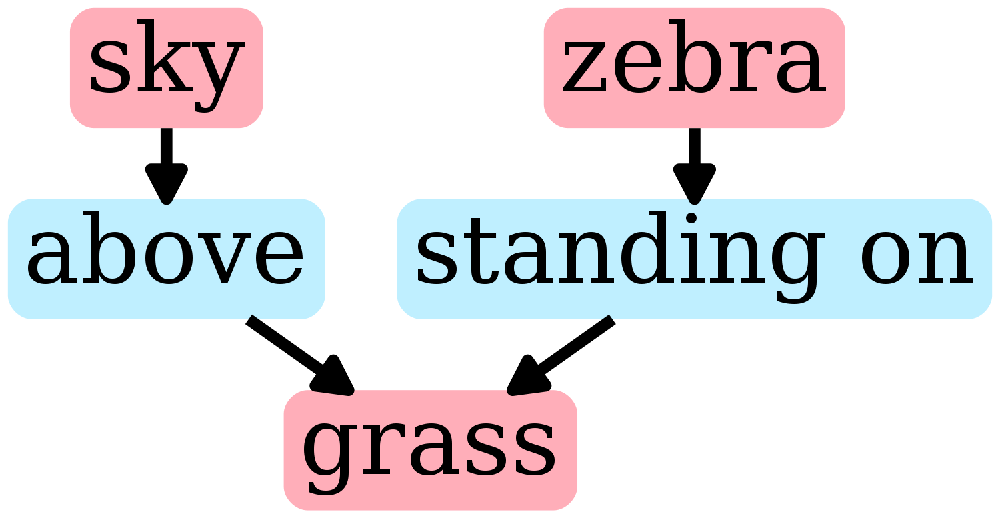
  
  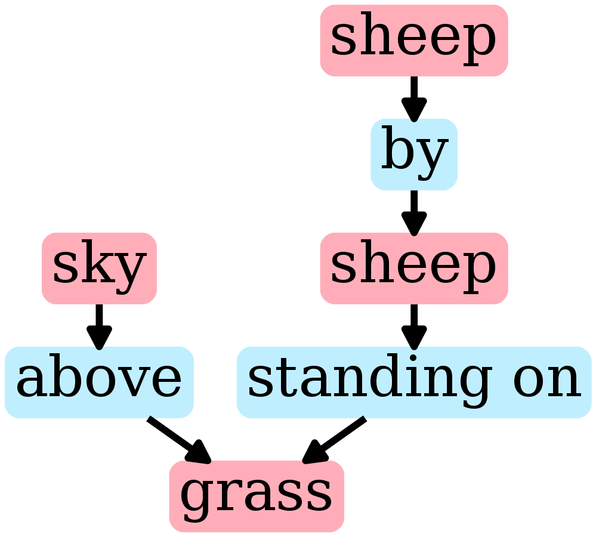
  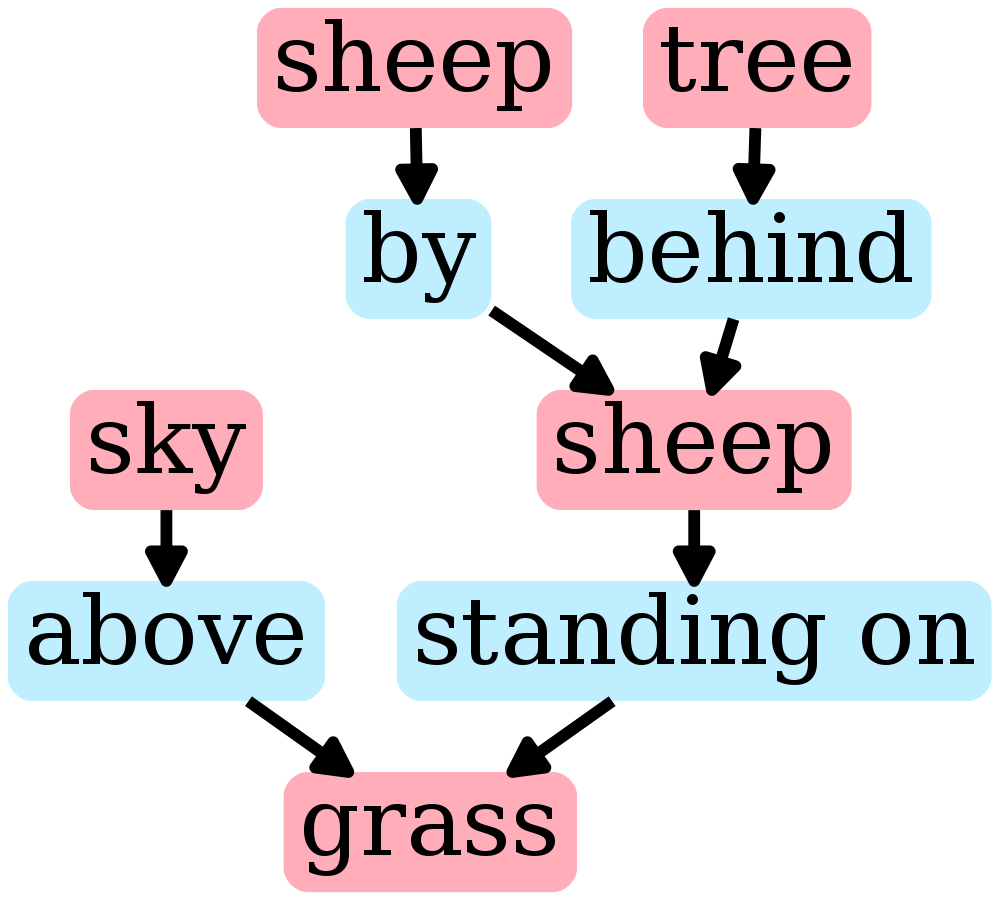
  
  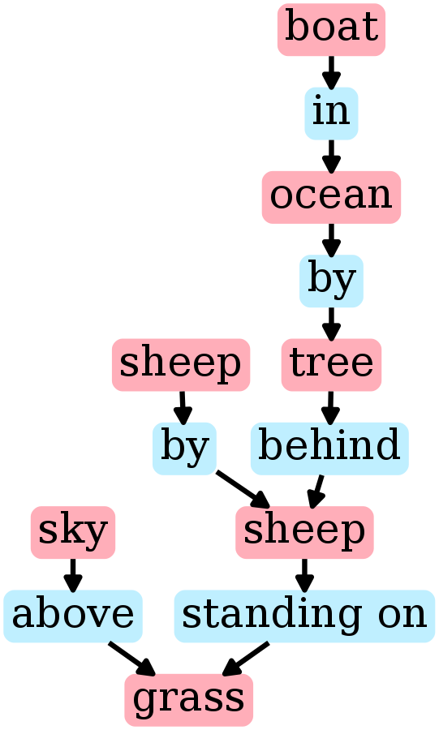
  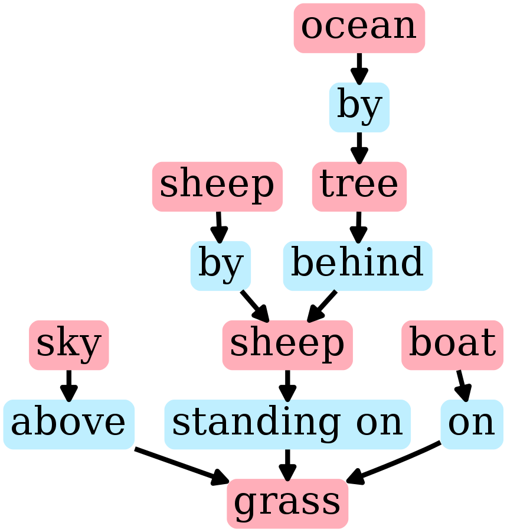
  <br>
  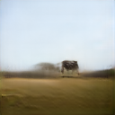
  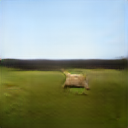
  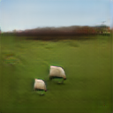
  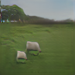
  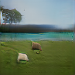
  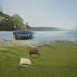
  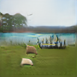
</div>

If you find this code useful in your research then please cite
```
@inproceedings{johnson2018image,
  title={Image Generation from Scene Graphs},
  author={Johnson, Justin and Gupta, Agrim and Fei-Fei, Li},
  booktitle={CVPR},
  year={2018}
}
```

## Model
The input scene graph is processed with a *graph convolution network* which passes information along edges to compute embedding vectors for all objects. These vectors are used to predict bounding boxes and segmentation masks for all objects, which are combined to form a coarse *scene layout*. The layout is passed to a *cascaded refinement network* (Chen an Koltun, ICCV 2017) which generates an output image at increasing spatial scales. The model is trained adversarially against a pair of *discriminator networks* which ensure that output images look realistic.

<div align='center'>
  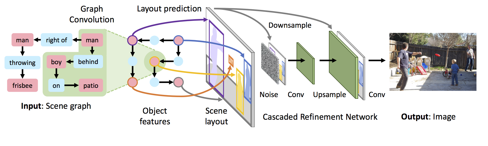
</div>

## Setup
All code was developed and tested on Ubuntu 16.04 with Python 3.5 and PyTorch 0.4.

You can setup a virtual environment to run the code like this:

```bash
python3 -m venv env               # Create a virtual environment
source env/bin/activate           # Activate virtual environment
pip install -r requirements.txt   # Install dependencies
echo $PWD > env/lib/python3.5/site-packages/sg2im.pth  # Add current directory to python path
# Work for a while ...
deactivate  # Exit virtual environment
```

## Pretrained Models
You can download pretrained models by running the script `bash scripts/download_models.sh`. This will download the following models, and will require about 355 MB of disk space:

- `sg2im-models/coco64.pt`: Trained to generate 64 x 64 images on the COCO-Stuff dataset. This model was used to generate the COCO images in Figure 5 from the paper.
- `sg2im-models/vg64.pt`: Trained to generate 64 x 64 images on the Visual Genome dataset. This model was used to generate the Visual Genome images in Figure 5 from the paper.
- `sg2im-models/vg128.pt`: Trained to generate 128 x 128 images on the Visual Genome dataset. This model was used to generate the images in Figure 6 from the paper.

Table 1 in the paper presents an ablation study where we disable various components of the full model. You can download the additional models used in this ablation study by running the script `bash scripts/download_ablated_models.sh`. This will download 12 additional models, requiring and additional 1.25 GB of disk space.

## Running Models
You can use the script `scripts/run_model.py` to easily run any of the pretrained models on new scene graphs using a simple human-readable JSON format. For example you can replicate the sheep images above like this:

```bash
python scripts/run_model.py \
  --checkpoint sg2im-models/vg128.pt \
  --scene_graphs scene_graphs/figure_6_sheep.json \
  --output_dir outputs
```

The generated images will be saved to the directory specified by the `--output_dir` flag. You can control whether the model runs on CPU or GPU using py passing the flag `--device cpu` or `--device gpu`.

We provide JSON files and pretrained models allowing you to recreate all images from Figures 5 and 6 from the paper.

#### (Optional): GraphViz
This script can also draw images for the scene graphs themselves using [GraphViz](http://www.graphviz.org/); to enable this option just add the flag `--draw_scene_graphs 1` and the scene graph images will also be saved in the output directory. For this option to work you must install GraphViz; on Ubuntu 16.04 you can simply run `sudo apt-get install graphviz`.

## Training new models
Instructions for training new models can be [found here](TRAINING.md).
